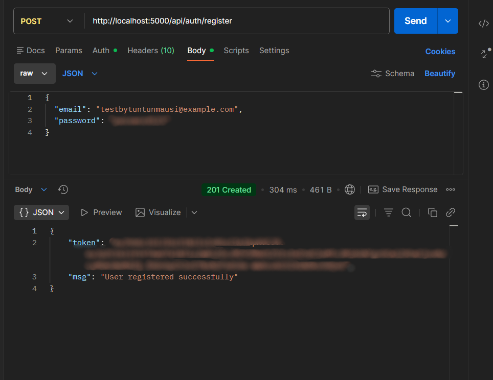
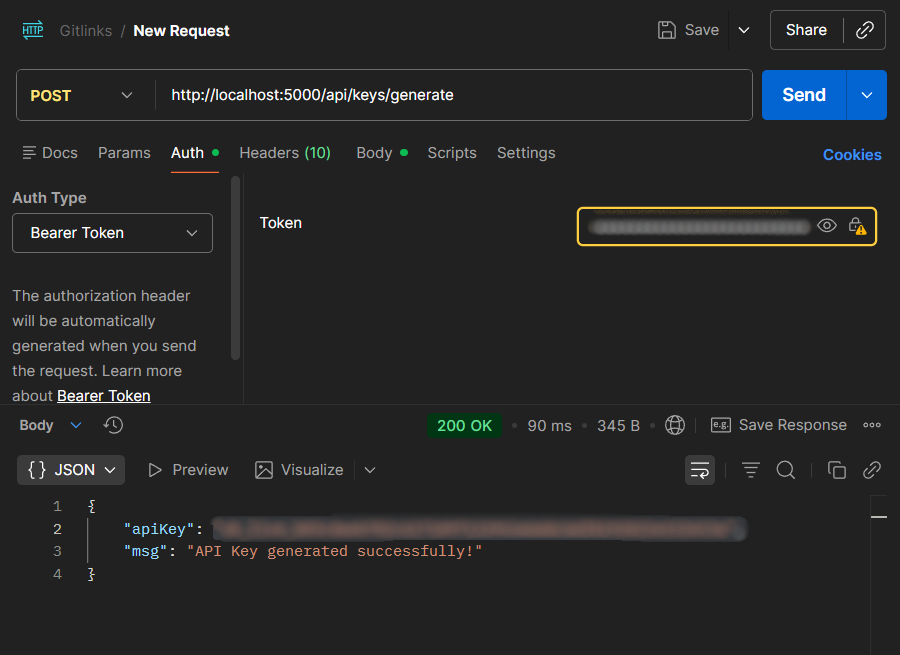
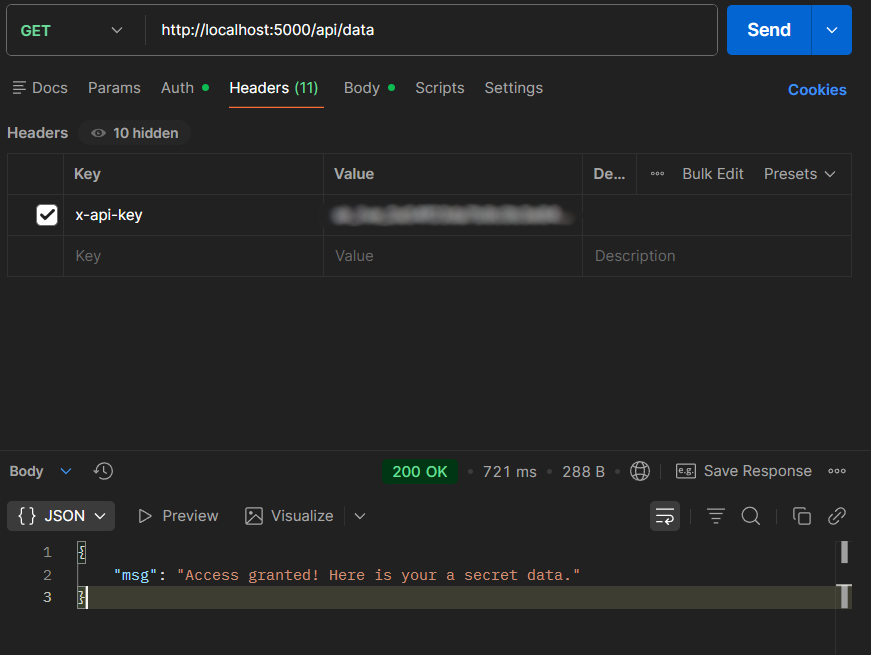

---

# 🚀 API Rate Limiter with Authentication

A secure backend API built using **Node.js, Express, MongoDB, JWT, and Upstash Redis**.

This project allows users to:

* 🔐 Register & Login
* 🔑 Generate a unique API Key
* 🚦 Access protected APIs with rate limiting (10 requests/minute)

---

## 🛠 Tech Stack

* Node.js
* Express.js
* MongoDB + Mongoose
* JWT (jsonwebtoken)
* bcryptjs
* Upstash Redis
* Crypto (Node.js built-in)

---

## ⚙️ How to Run Locally

###  Clone the repository

```bash
git clone https://github.com/your-username/api-rate-limiter.git
cd api-rate-limiter
```

### Install dependencies

```bash
npm install
```

### Create `.env` file in root directory

```
PORT=5000
MONGO_URI=your_mongodb_connection_string
JWT_SECRET=your_secret_key
UPSTASH_REDIS_REST_URL=your_redis_url
UPSTASH_REDIS_REST_TOKEN=your_redis_token
```

### Start the server

```bash
node server.js
```

or

```bash
npm run dev
```

Server runs at:

```
http://localhost:5000
```

---

## 🔐 API Flow

###  Register User

`POST /api/auth/register`

###  Login User

`POST /api/auth/login`
Returns JWT token.

###  Generate API Key (Protected)

`POST /api/keys/generate`
Requires:
`Authorization: Bearer <JWT_TOKEN>`

###  Access Protected API

`GET /api/data`
Requires:
`x-api-key: <YOUR_API_KEY>`

Rate limit: **10 requests per minute**

---


## 🎯 Features

* JWT Authentication
* Secure Password Hashing (bcrypt)
* API Key Generation
* API Key Validation
* Redis-based Rate Limiting
* Middleware-based Route Protection
* Clean MVC Architecture

---

## 📚 What I Learned

* Implementing JWT authentication
* Hashing passwords securely
* Protecting routes using middleware
* Integrating Redis for rate limiting
* Managing environment variables securely
* Structuring scalable backend applications

---

## 👩‍💻 Author

Gitanjali
Backend Developer | Node.js & Security Enthusiast

---

---

## 📸 API Rate Limiter – Request & Response Screenshots

* User Login – JWT Authentication

  


* API Key Generation (JWT Protected)

  


* Access Protected API Using Valid API Key

 


* Rate Limit Triggered – 429 Too Many Requests

 


---
